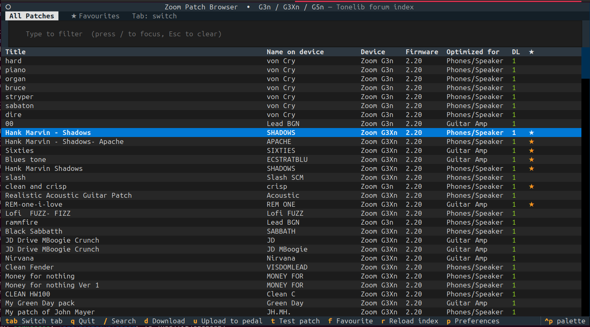
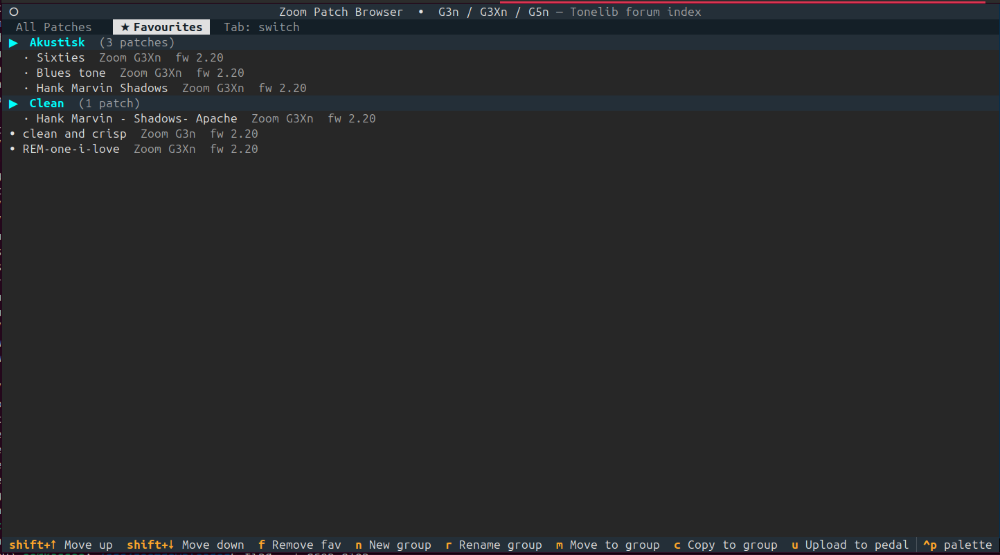
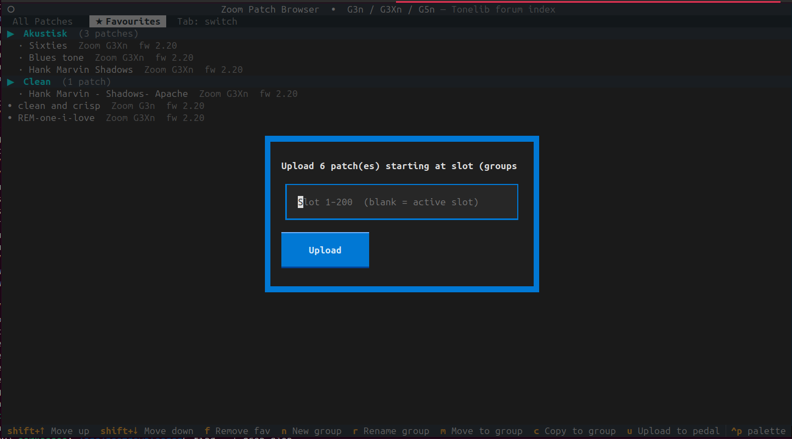
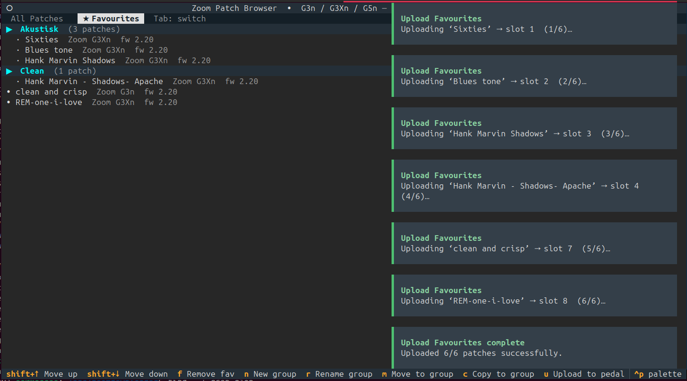
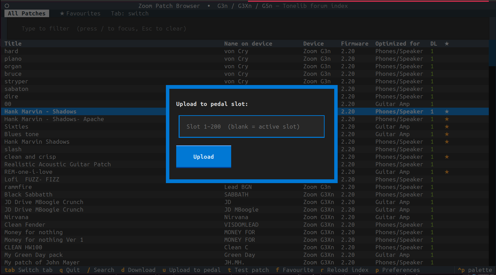
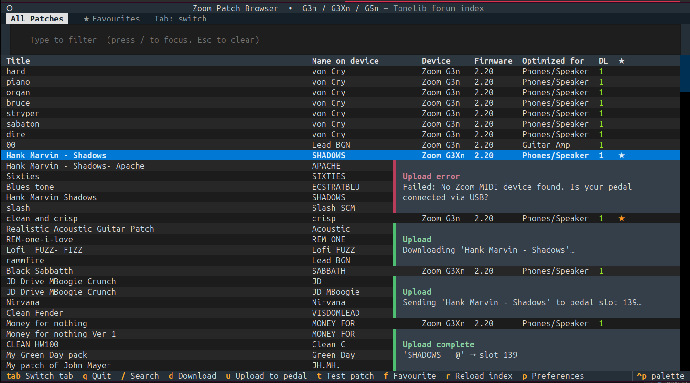
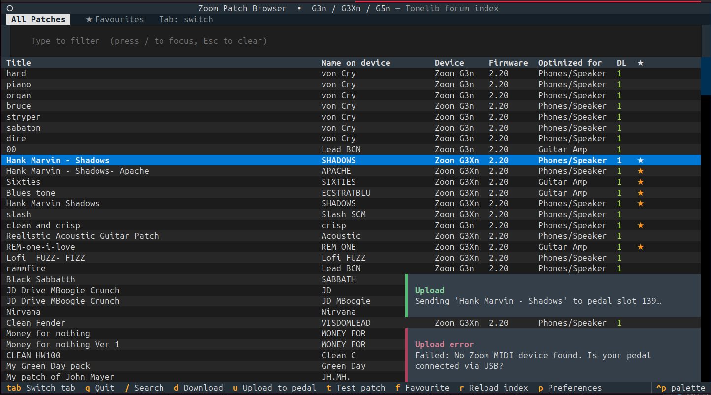

# Screenshots

## Main patch browser

The **All Patches** tab lists every indexed patch with title, name-on-device, device, firmware, optimized-for, download count, and favourite marker. Press `/` to search, `Enter` for the detail view.

## Favourites

The **Favourites** tab shows your curated collection, organized into named groups. Each entry displays the patch title alongside the target pedal model and firmware version.

## Uploading favourites to the pedal

Press `u` from the Favourites tab to upload the entire collection to the pedal, bank-aligned. Groups are padded so no stale patch is left in a partially-filled bank.

A confirmation dialog reports how many patches were written.

## Uploading a single patch

Press `u` on any patch to upload it to a specific slot. Leave the slot field blank to target the pedal's currently active slot — no need to remember the slot number.

Success and failure are both reported inline so you know immediately whether the patch was written.
